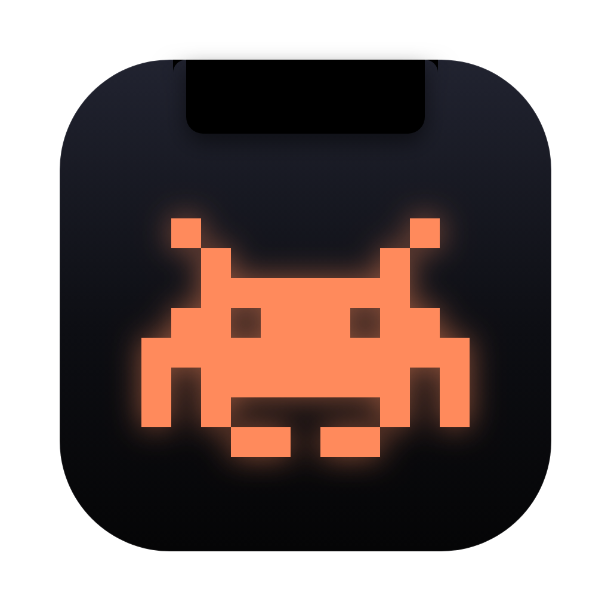
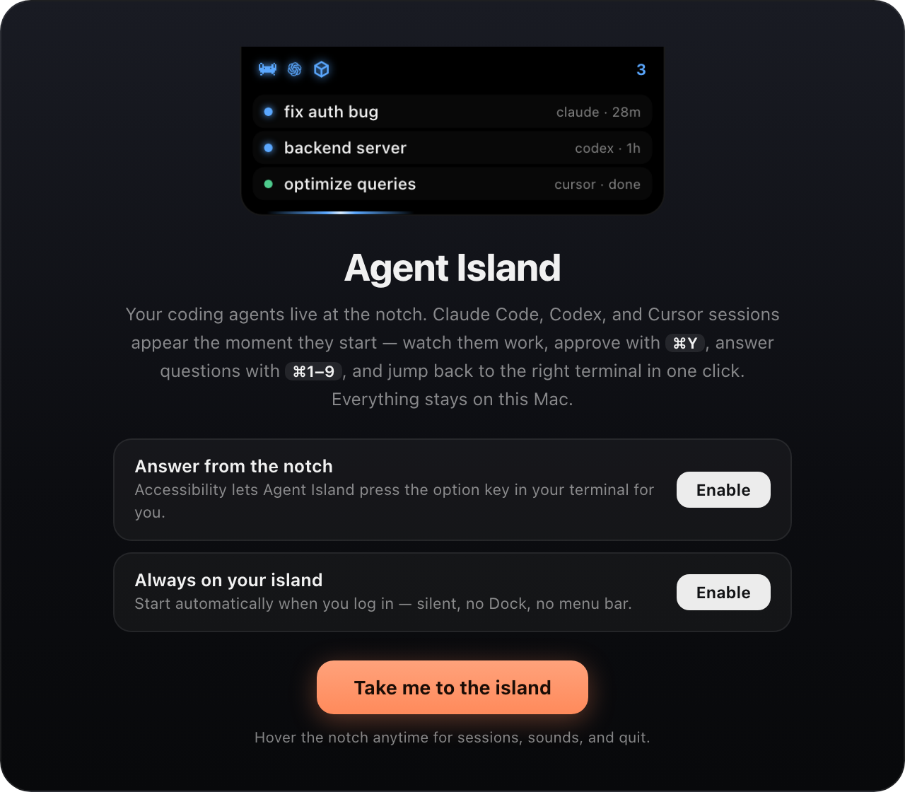

<p align="center">
  
</p>

<h1 align="center">Agent Island</h1>

<p align="center">
  <b>The Dynamic Island for your coding agents.</b><br/>
  Claude Code, Codex, and Cursor sessions — live around your MacBook's notch.
</p>

<p align="center">
  <a href="https://github.com/soummyaanon/DEV-island-releases/releases/latest/download/Agent-Island.dmg"></a>
  <a href="https://github.com/soummyaanon/DEV-island/actions/workflows/ci.yml"></a>
  
  
</p>

<p align="center">
  
</p>

---

Run agents in parallel across terminals and IDEs, and the island wraps your
MacBook's notch to tell you — at a glance — who's working, who's done, and who
needs you. Hover to expand; click a session to jump straight back to its
terminal.

## Agents

| Agent | How it connects | Setup |
| --- | --- | --- |
| **Claude Code** | HTTP hooks (all six lifecycle events) | automatic on first launch |
| **Codex** | read-only tail of its local rollout logs | none at all |
| **Cursor** | hooks + a fire-and-forget bridge script | automatic on first launch |

Each running agent gets its own animated sprite in the notch wing — the pixel
crab for Claude, the OpenAI blossom for Codex, the cube for Cursor — shown
**only while that agent is actually working**, side by side when several run
at once. The island measures your hardware notch at startup and adapts to any
MacBook (Pro 14"/16", Air 13"/15", or no notch at all).

## Features

- **Live session rows** — project, elapsed time, current activity ("Running
  pnpm test", "Editing index.ts"), agent, host app, and permission mode. Color-
  coded states: working, waiting on you, done, failed.
- **Approve from the notch** — Claude permission requests appear as a card with
  the full command or diff. <kbd>⌘Y</kbd> / <kbd>⌘N</kbd> decide from anywhere;
  if you don't answer, Claude's own prompt takes over untouched.
- **Answer questions from the notch** — when an agent asks a multiple-choice
  question, the island auto-expands and <kbd>⌘1–9</kbd> (or a click) answers it.
  Claude questions are answered directly through the hook — no terminal focus,
  no extra permissions, works in any terminal. Codex answers are typed into the
  terminal (iTerm2 out of the box; other terminals after granting Accessibility
  in onboarding).
- **Jump back** — click a session and the app that hosts it comes forward: the
  exact iTerm2 tab, Cursor itself when Claude runs in Cursor's terminal (the
  island reads the process's real host app — no guessing), Terminal, Warp,
  Ghostty, WezTerm, VS Code.
- **Sound themes** — pick 8-bit chiptunes, Arcade, Soft chimes, or the Anime
  pack in Settings, with per-event overrides and previews: distinct sounds for
  done, needs-you, question-asked, and a confirm chime when you allow something.
  Quick toggle in the panel footer.
- **Codex usage footer** — your plan's remaining quota, read locally from
  Codex's own logs.
- **Weather in the quiet moments** — with nothing running, the island becomes a
  small live weather scene: drifting clouds, falling rain, lightning in a
  thunderstorm, a crescent and stars at night, sunrise and sunset, a rainbow
  after the rain clears. Agents always take priority, so it never competes with
  work. Off by default; see [Privacy](#privacy).
- **Sized to what it's showing** — the expanded panel measures its content and
  grows to fit, up to 720px, so a long diff is readable instead of scrolled.
- **Accessible on purpose** — <kbd>⌃⌥⌘I</kbd> hands the island keyboard focus
  for VoiceOver (Escape gives it back), every row is a real button, and Reduce
  Motion, Increase Contrast, and Reduce Transparency are all followed. Text size
  is adjustable in Settings. On a Force Touch trackpad, each kind of event has
  its own haptic rhythm.
- **Feels like a system app** — no Dock icon, no menu-bar icon; the island
  *is* the app. Sounds, quit, and everything else live in the expanded panel.
  A one-time onboarding sets up Accessibility and open-at-login.

## Privacy

Everything about your sessions stays on your Mac. The daemon binds to
`127.0.0.1` only, requests are token-authenticated, and there are **no
accounts, no API keys, no telemetry**. Codex integration never writes a single
byte to Codex's files, and the Cursor bridge returns instantly so Cursor never
waits on Agent Island.

Exactly two things ever leave your machine, both listed here in full:

| | What is sent | When | Turn it off |
| --- | --- | --- | --- |
| **Update check** | Nothing but the request itself, to the public GitHub Releases API | On launch, then hourly | Settings → General, or `AGENT_ISLAND_NO_UPDATE_CHECK=1` |
| **Weather** (off by default) | A latitude and longitude rounded to 2 decimals (~1km), to `open-meteo.com`. No account, no API key, no identifier | Every 15 minutes while enabled | Settings → Weather (it ships off) |

**Nothing about your sessions, prompts, projects, or agents is ever
transmitted**, to either endpoint.

On weather specifically: it is off until you switch it on, and while it's off
no weather request is made at all. Your location is resolved locally, in this
order — whatever you typed in Settings, then a device location fix if you've
granted one, then a guess from your Mac's time zone (read from the tz database
already on your disk: no permission, no network, accurate to the nearest large
city). The coordinates are rounded before the request, so even with a precise
device fix, what's transmitted is city-scale.

## Install

1. [Download the DMG](https://github.com/soummyaanon/DEV-island-releases/releases/latest/download/Agent-Island.dmg) (always the latest release).
2. Drag **Agent Island** into **Applications** and open it.
3. Because this release is ad-hoc signed, macOS may say it “could not verify”
   the app. Click **Done**, then open **System Settings → Privacy & Security**
   and click **Open Anyway**. This is required only once.

   Terminal alternative: `xattr -cr "/Applications/Agent Island.app"`

On first launch the onboarding wires everything up: Claude Code hooks are
safe-merged into `~/.claude/settings.json`, the Cursor bridge into
`~/.cursor/hooks.json` (existing hooks from other tools are preserved, with
timestamped backups), and Codex needs nothing. Restart any already-running
agent sessions so they pick up the hooks.

## Architecture

```
Claude Code ──HTTP hooks──▶
Cursor ───bridge script───▶   agentislandd (127.0.0.1:7433)   ──WebSocket──▶  notch overlay
Codex rollout logs ◀──tail──  canonical events → session state                (Electron panel)
```

- **`packages/daemon`** — `agentislandd`: Fastify server that normalizes every
  agent's raw signals into one canonical event vocabulary, folds them into
  per-session state, and streams snapshots over WebSocket. Adapters:
  `claude` (hook routes), `codex` (rollout tailer), `cursor` (hook routes).
- **`packages/app`** — the Electron overlay: a click-through panel window that
  truly hugs the notch (`type: "panel"` + `enableLargerThanScreen`), measures
  the real notch width via AppKit, and renders the island.
- **`packages/shared`** — the zod schemas both sides trust. The only place the
  contract lives.

## Development

```bash
pnpm install
pnpm dev          # daemon (tsx watch) + app (electron-vite dev)
pnpm test         # vitest — adapter mappers & the rollout tailer
pnpm typecheck    # all packages
pnpm package      # signed DMG in packages/app/release/
```

Useful env vars: `AGENT_ISLAND_PORT` (default 7433), `AGENT_ISLAND_TRAY=1`
(restore the menu-bar icon), `AGENT_ISLAND_STRICT=1` (reject unauthenticated
requests even in dev), `CODEX_HOME`, `AGENT_ISLAND_HOME`,
`AGENT_ISLAND_WEATHER=<condition>` (force a weather scene without waiting for
the real sky — `clear-day`, `clear-night`, `cloudy`, `fog`, `rain`, `snow`,
`thunder`, `sunrise`, `sunset`, `rainbow`; skips the network entirely).

The native sidecar (`native/AgentIslandNative.swift`, haptics + CoreLocation) is
built by `scripts/build-native.sh` as part of `pnpm build`. It needs `swiftc`;
without Xcode Command Line Tools the script skips it and the app runs with
haptics inert and weather on its time-zone fallback.

## Roadmap

- Silent in-app auto-updates.
- Homebrew cask.
- Precise tab jump for more terminals.
- More agents.
